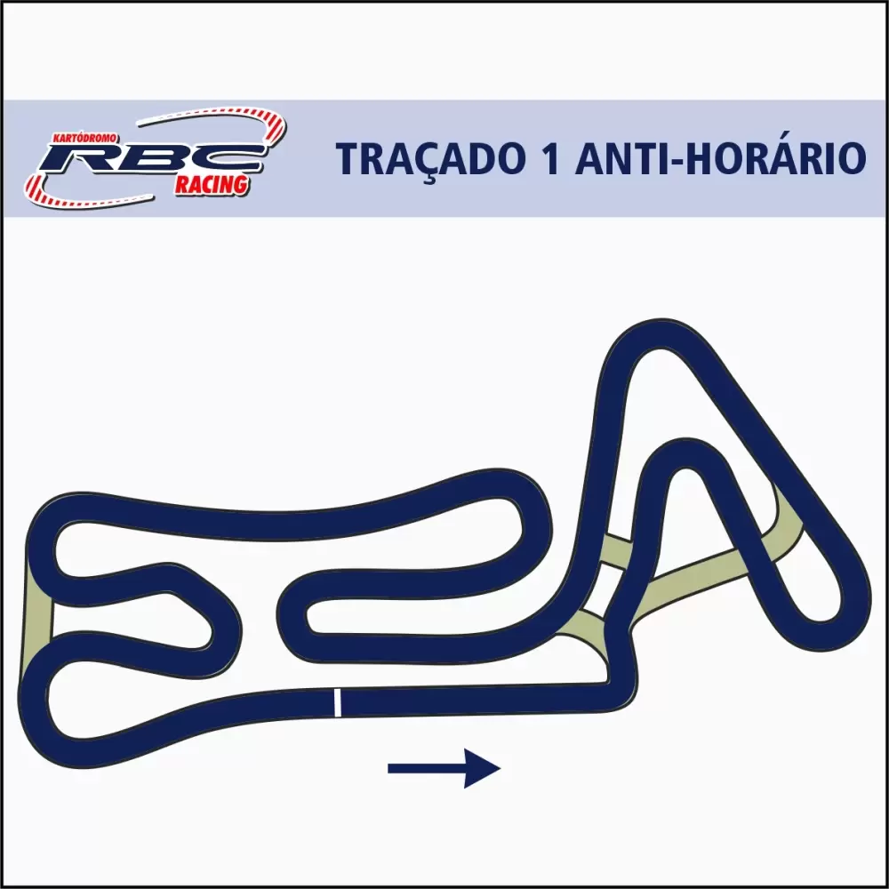
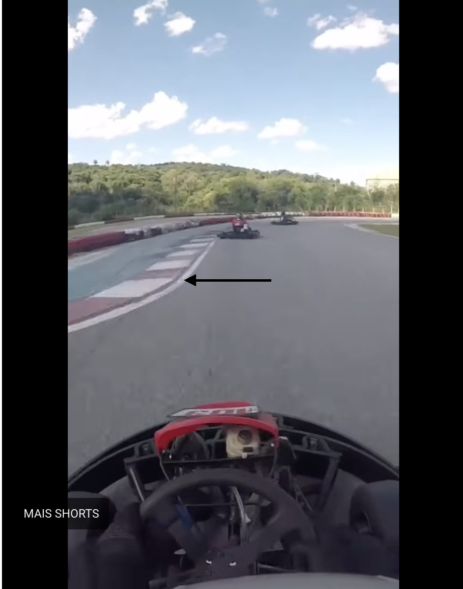
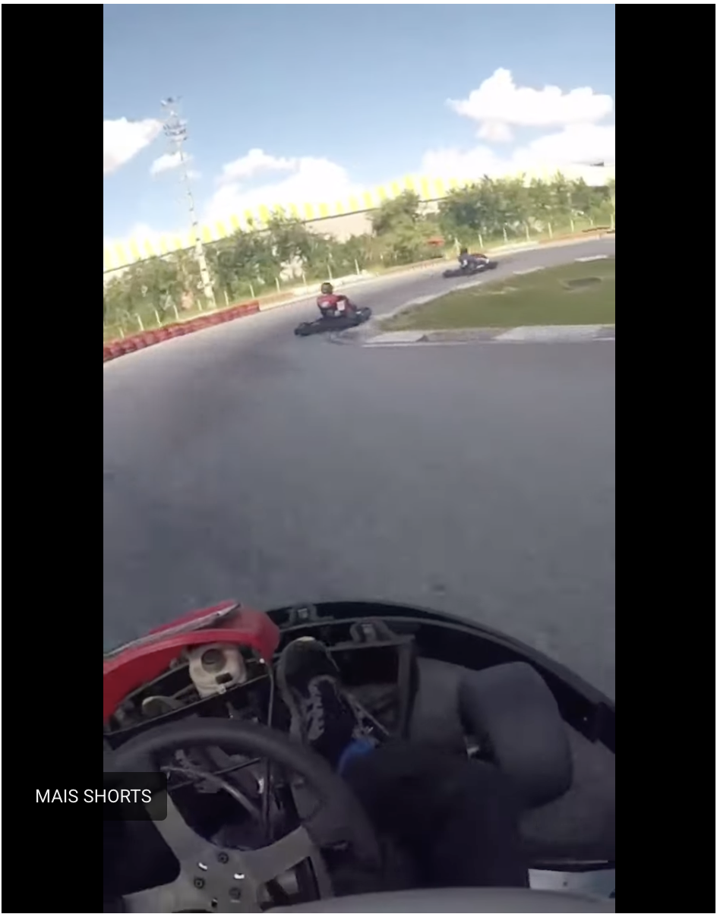

# Netkart Acesso — 2ª Etapa | RBC | 14/03/2026

> Traçado 1 — Anti-horário (invertido)

## Informações da prova

| | |
|---|---|
| Campeonato | Netkart Acesso |
| Kartódromo | RBC |
| Traçado | 1 Anti-horário |
| Data | 14/03/2026 |
| Treinos | A partir de semana que vem |

---

## Mapa do traçado

**Sentido:** anti-horário → largada/chegada na base, direção para a direita.

**Leitura geral do traçado:**
- **Setor direito (S1):** seção triangular fechada no canto superior direito — curvas lentas e técnicas
- **Setor central (S2):** chicane/esse de ligação entre os dois lados
- **Setor esquerdo (S3):** sequência de esses e hairpin no canto esquerdo — o trecho mais lento

---

## Referências por curva

> Numerar as curvas conforme os onboards e ajustar nomes depois dos treinos.

### C1 — Primeira curva (saída da reta de largada)

- **Entrada / frenagem:** 
    1. soltar o acelerador no colchete 24
    2. virar o volante
    3. retomar aceleração total na faixa direita dos colchetes da esquerda
- **Apex:**
    1. não atropelar a zebra, muito alta, passar bem próximo dela somente
- **Saída:**
    1. deixar o kart rolar até a outra zebra
- **Notas:**

### C2

- **Entrada / frenagem:**
    1. levar o kart para o canto esquerdo da pista
    2. iniciar a frenagem na primeira zebra vermelha logo após a região abaloada da zebra
    
- **Apex:**
    1. assim que soltar o freio
    TESTES
    a. deixar rolar bem pouco e retomar aceleração máxima
    b. já voltar a acelerar antes do apex
    
- **Saída:**
    1. deixar o kart espalhar pelo lado esquerdo da pista SEM ir até o limite dela
- **Notas:**

### C3 — Triângulo: vértice superior

- **Entrada / frenagem:**
    1. levar o kart próximo a zebra da direita
    TESTES
    a. soltar o acelerador por um breve momento e acelerar novamente
    b. fazer a curva com aceleração total
- **Apex:**
    1. a zebra é alta, portanto NÃO parece fazer sentido pegar essa zebra
    2. passar muito próximo da zebra
- **Saída:**
    1. deixar o kart espalhar até a linha branca do lado direito
- **Notas:**

### C4 — Triângulo: saída

- **Entrada / frenagem:**
- **Apex:**
- **Saída:**
- **Notas:**

### C5 — Ligação / esse central

- **Entrada / frenagem:**
- **Apex:**
- **Saída:**
- **Notas:**

### C6 — Esse esquerdo: entrada

- **Entrada / frenagem:**
- **Apex:**
- **Saída:**
- **Notas:**

### C7 — Esse esquerdo: saída

- **Entrada / frenagem:**
- **Apex:**
- **Saída:**
- **Notas:**

### C8 — Hairpin / laço esquerdo

- **Entrada / frenagem:**
- **Apex:**
- **Saída:**
- **Notas:**

### C9 — Retorno para a reta de largada

- **Entrada / frenagem:**
- **Apex:**
- **Saída:**
- **Notas:**

<!-- Adicione ou renomeie curvas conforme for identificando nos onboards -->

---

## Setores

| Setor | Trecho | Pontos-chave |
|---|---|---|
| S1 — Triângulo direito | C1 a C4 | Freadas fortes, curvas lentas em sequência |
| S2 — Ligação central | C5 | Chicane / esse de transição |
| S3 — Labirinto esquerdo | C6 a C9 | Esses encadeados, hairpin, retorno à reta |

---

## Observações dos onboards

> Anote aqui o que chamar atenção assistindo os vídeos — trajetórias, referências visuais, erros comuns, oportunidades.

-

---

## Capturas de onboard

<!-- Salve as capturas na pasta e referencie assim:

-->

---

## Estratégia de tomada de tempo

-

---

## Pontos de ultrapassagem

| Curva | Descrição | Observação |
|---|---|---|
| | | |

---

## Aprendizados da Etapa 1 para aplicar aqui

- Manter a linha nas primeiras voltas — não sair por dentro do pelotão
- Paciência nas primeiras voltas, especialmente em pista desconhecida
- Manter estratégia de parceria com Bruno (#127) na tomada de tempo
